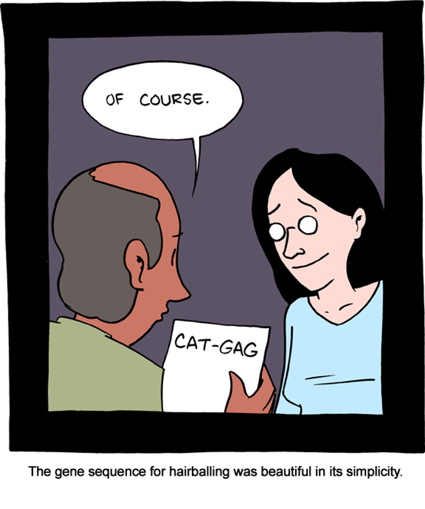

# Repo for Day2 PM: Annotations

Comic: Zach Weinersmith

## Annotation is the process of identifying and associating function to various segments of the assembled DNA sequence. It can be broken down 

Maria: Add general information on annotations and databases (including caveats)

 
 **Prokka**
 
 **DRAM**
  https://academic.oup.com/nar/article/48/16/8883/5884738
  
  Call genes with Prodigal 
  
  ORF predicted amino acid sequences are searched against KEGG, Pfam, UniRef90 and MEROPS using MMseqs2 
  
  HHMER3 is used for HMM profile searches of dbCAN and VOGDB
  
  Include tables of the annotation outputs but Melody will explain them using the produced examples

*Maria*: Add notebook for the pipeline
  - Set the environment for prokka
  - Run prokka in ~10 SAGs (maybe each participants picks one row)
  - Set the environement for DRAM
  - Run DRAM in one SAG
  - Provide link to output for all SAGs

*Melody*: Add an extra page discussing 
  - examples of misannotations
  - how to refine annotations
